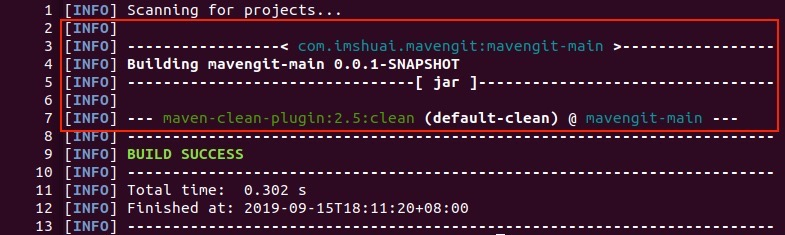
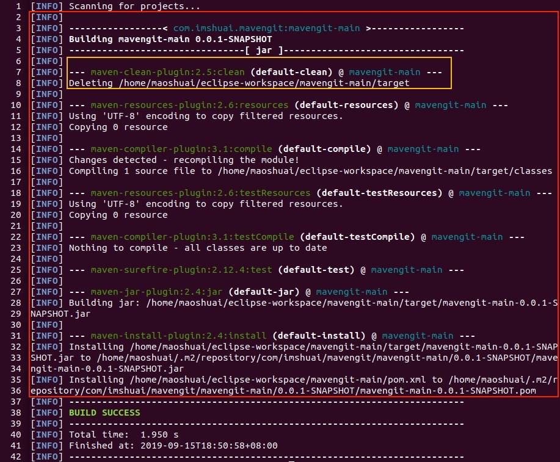
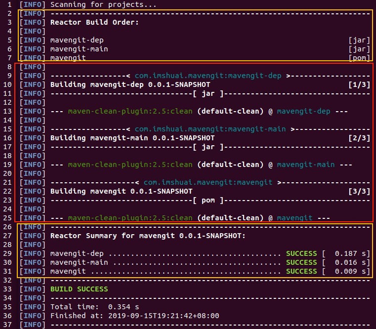
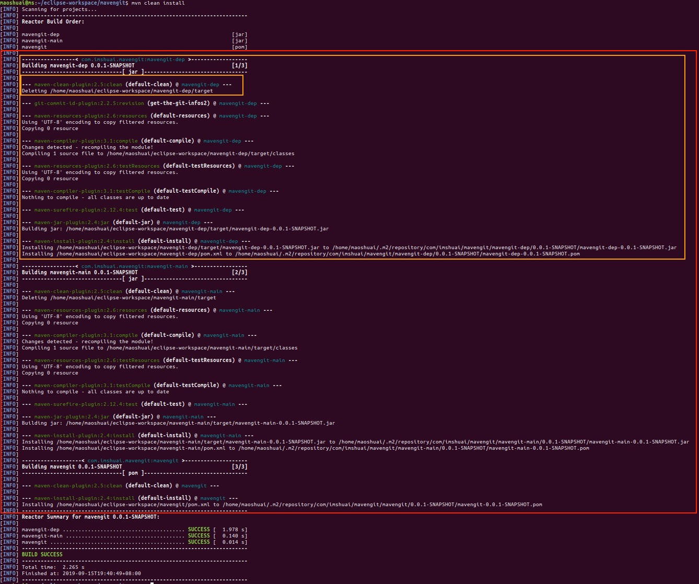
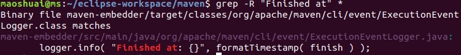

使用maven，总要执行mvn命令，而mvn总会输出一坨繁琐的日志；大部分情况下，只要知道SUCESS和FAILURE，不计较的话，也能应付工作。但每一行日志到底作用为何，糊里糊涂，总觉得不爽，趁假期结合maven源码琢磨了一番，总结整理如下。

>  本篇是除每周五更新，中秋额外加餐^_^

# 最简单的输出

首先，从简单的开始，我们创建一个空的maven工程，直接执行`mvn clean`命令，为了避免第一次出现太多的downloading日志干扰，**重复执行第二次再观察**。此时，输出的日志可能类似如下的简洁输出（为了方便，我增加了行号）：




上述的日志，我总结大体分为3个部分：

1. 第一部分（line 1，红色框上方）：表示mvn开始扫描工程。这里只有一个工程。
2. 第二部分（line 2-7，红色框内）：这是mvn执行的主要内容，一般会非常多。下面单独说明。
3. 第三部分（line 8-13，红色框下方）：其中8到9行，输出本次执行的结果是否成功；第10到12行，输出了执行时间信息；最后一行横线，用于收尾。

**第二部分详细说明：**

这一部分，会分成两个层次输出，**第一个层是：project，第二层是在该project下执行的plugin**。

第一层输出project信息（主要就是坐标信息），maven用了4行（line 2-5）完成。首先**输出一行空行以示分隔**（line 2），然后输出一行包含groupId和artifactId的行（）line 3；接下来`Building`开头输出artifactId和version（line 4）；然后输出一行横线（line 5），其中居中包含了packaging的形式。

第二层输出plugin信息（line 6-7）。这个例子里指出现了一个plugin的执行。首先输出一行空行（line 6）以示分隔，然后以**3个横线开头**输出一行plugin相关的信息，这里我们只执行了clean生命周期，关联的是maven-clean-plugin插件的clean目标，输出的格式是：plugin的artifactId: plugin的版本号:plugin的goal，plugin执行的id @ 工程的artifactId

通过第二部分，我们可以清晰的看到maven运行时涉及了哪些工程，以及每个工程执行了哪些插件。

# 稍微复杂些

这一次，我们执行`mvn clean install`，会触发更多的插件执行：下面的红色框就是第二部分，其中黄色框中是之前就包含的clean插件，随后又出现了7个新的插件执行过程（都是空行隔开，三个横线开头）。每个插件还会进一步输出自己的“正文”日志。




# 再复杂些：聚合多个工程

接下来，我们增加一个聚合工程，即通过`mavengit`这个工程聚合`mavengit-dep`和`mvengit-main`两个工程。其中`mavengit-maven`依赖`mavengit-dep`。然后在mavengit工程里执行`mvn clean`，输出日志如下：




红色框，还是我们之前所谓的“第2部分”，我们注意到上下新增两块内容（黄色框），分别是针对聚合工程的内容，第一个黄色块内容是确定反应堆（reactor）的顺序，即根据工程的依赖关系确定构建顺序；第二个黄色框，则是对每个工程的执行汇总。

至于红色框，也有新变化。首先我们看到了根据reactor确定的build order，依次出现了3个工程的信息，每个工程还在Building行的行尾增加了序号表示进度。至于每个project内的plugin执行情况并无变化。

# 再再复杂些：聚合多个工程+多个插件

有了上面的基础，相信下面的内容可以清晰的看懂了。我也用方框将各个部分做了标记。



# 源代码分析

上面只是根据输出情况的黑盒总结，实际情况可以通过maven的源代码查看。首先，我们到github上clone了源代码到本地。

一个现实的问题是，代码很庞大，我怎么确定控制日志输出的源代码在哪呢？搜索关键字是最简单的方法，于是我在根目录搜索"Finished at"这个关键字（日志输出的倒数第二行总是有这个内容），不出所料，`ExecutionEventLogger.java`应该就是主要的相关类了。



在IDE打开`maven-embedder`这个工程，定位到`ExecutionEventLogger.java`，看到继承自`AbstractExecutionListener`，进一步看到这个类在`org.apache.maven.cli.MavenCli`这个命令行处理的入口函数中被调用：

```Java
ExecutionListener executionListener = new ExecutionEventLogger();
if ( eventSpyDispatcher != null )
    {
        executionListener = eventSpyDispatcher.chainListener( executionListener );
     }
```

不出意料的话，这应该是一个**观察者模式**，`ExecutionEventLogger.java`实现的接口的方法，对应了每个mvn步骤，因此只要在对应的方法中实现日志打印即可。

比如下面的方法，就实现了第一部分的日志：

```Java
   @Override
    public void projectDiscoveryStarted( ExecutionEvent event )
    {
        if ( logger.isInfoEnabled() )
        {
            logger.info( "Scanning for projects..." );
        }
    }
```

而下面的方法，就实现了第二部分的没个project的日志打印：

```Java
   @Override
    public void projectStarted( ExecutionEvent event )
    {
        if ( logger.isInfoEnabled() )
        {
            MavenProject project = event.getProject();

            logger.info( "" );

            // -------< groupId:artifactId >-------
            String projectKey = project.getGroupId() + ':' + project.getArtifactId();
            
            final String preHeader  = "--< ";
            final String postHeader = " >--";

            final int headerLen = preHeader.length() + projectKey.length() + postHeader.length();

            String prefix = chars( '-', Math.max( 0, ( LINE_LENGTH - headerLen ) / 2 ) ) + preHeader;

            String suffix = postHeader
                + chars( '-', Math.max( 0, LINE_LENGTH - headerLen - prefix.length() + preHeader.length() ) );

            logger.info( buffer().strong( prefix ).project( projectKey ).strong( suffix ).toString() );

            // Building Project Name Version    [i/n]
            String building = "Building " + event.getProject().getName() + " " + event.getProject().getVersion();

            if ( totalProjects <= 1 )
            {
                infoMain( building );
            }
            else
            {
                // display progress [i/n]
                int number;
                synchronized ( this )
                {
                    number = ++currentVisitedProjectCount;
                }
                String progress = " [" + number + '/' + totalProjects + ']';

                int pad = LINE_LENGTH - building.length() - progress.length();

                infoMain( building + ( ( pad > 0 ) ? chars( ' ', pad ) : "" ) + progress );
            }

            // ----------[ packaging ]----------
            prefix = chars( '-', Math.max( 0, ( LINE_LENGTH - project.getPackaging().length() - 4 ) / 2 ) );
            suffix = chars( '-', Math.max( 0, LINE_LENGTH - project.getPackaging().length() - 4 - prefix.length() ) );
            infoMain( prefix + "[ " + project.getPackaging() + " ]" + suffix );
        }
    }
```

# 总结

1. mvn的日志总体上分为3个部分，其中第二部分是最主要的。第二部分，根据project和plugin分为两个层次。
2. 日志在每个层次都设计了不同的格式，便于阅读。
3. maven在代码实现上，使用观察者模式，实现了日志的输出。在做类似设计时可以参考。
