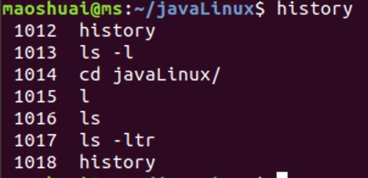
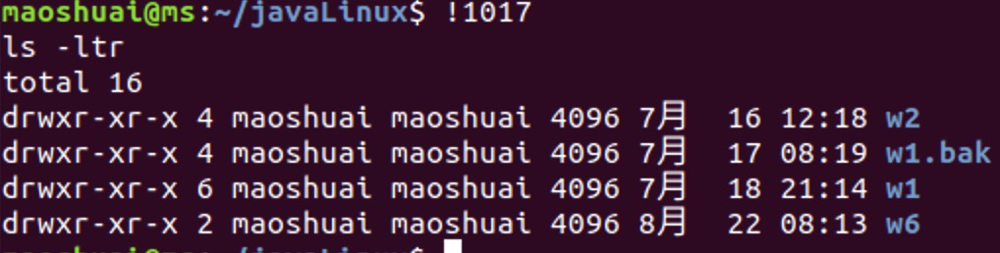
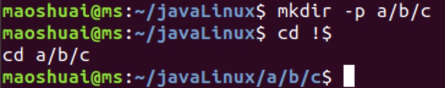
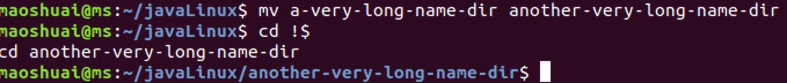
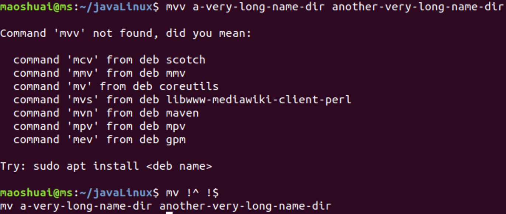
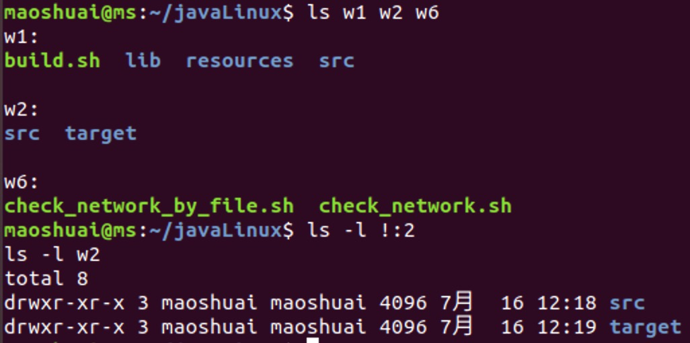
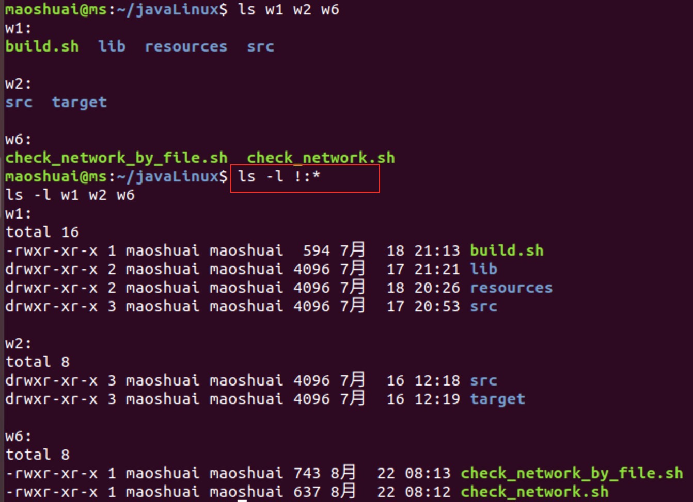

使用Bash时，通常会重复执行之前的命令，或修改之前的命令再执行。最简单的是鼠标选择并粘贴，老司机也会使用vi模式搜索或翻历史记录。除此之外，还可以借用bash提供的**历史命令展开（HIstory Expansion）**，有时更高效。

# 再次执行历史命令

通过history命令，我们可以查看执行过的命令，每个命令都有一个序号。使用!+命令序号，就可以再次执行这条命令。比如，通过history命令，查看历史如下：



执行`!1017`就相当于执行`ls -ltr`：



我们更常用的是执行前一条或前几条命令，这时候我们**可以用负数表示**，比如`!-1`代表上一条刚执行的命令，`!-2`代表倒数第二条命令，以此类推。另外`!!`也可以代表上一条刚执行的命令，与`!-1`的作用一样。

# 引用上一条命令的参数

有时候，我们只想引用上一条命令的参数。比如**创建了一个目录，然后cd到这个目录**。重新输入一遍很麻烦，这时候就可以用`!$`代表上一条命令的最后一个参数。但注意，**仅是最后一个参数**。



又比如：



# 引用上一条命令的2个参数

`!$`只能引用上一条命令的最后一个参数，如果要引用两个呢？与`!$`类似，`!^`代表**上一条命令的第一个参数**。

比如重命名一个文件时，mv命令打错成了mvv，可以用正确的命令重新执行：



# 引用上一条命令的多个参数

一般引用2个参数就足够用了。但如果你坚持，可以引用任何一个。比如`!:2`就代表上一条命令的第二个参数：



或者，可以用星号`*`表示所有参数：




# 完全体（History Expansion）

上面的命令用法，可以总结为如下完全体，前面的用法都可以看成它的特殊情况：

```
![Name or number of the command in history]:[argument number]
```

比如`!-1:1`就是上一条命令的第一个参数，和`!^`作用一样

而这种用法，其实就是`历史命令展开`，在bash的man文档里有更详细的介绍（`man bash`搜索HISTORY EXPANSION），支持更复杂的功能。

# 总结
1. 引用历史命令或参数的完全体是`![Name or number of the command in history]:[argument number]`
2. 常用的特殊形式：
    * `!!`或`!-1`上一条命令
    * `!-2`,上上一条命令
    * `!$`上一条命令的最后一个参数。`!^`上一条命令的第一个参数
    * `!:2` 上一条命令的第二个参数


